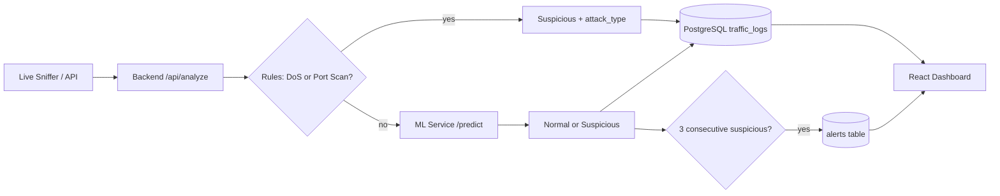
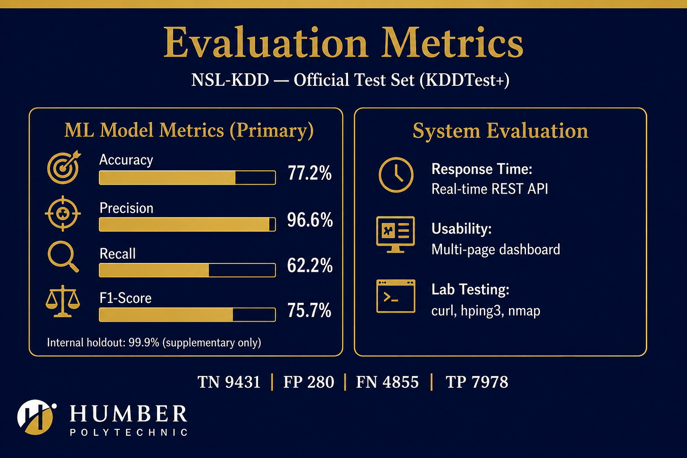

# NetGuard AI — Project Presentation

**Cyber Experts — Final Group Project**

*A Lightweight Machine Learning-Based Network Monitoring and Intrusion Detection System*

**Written report:** [NetGuard-AI-Written-Report.docx](NetGuard-AI-Written-Report.docx) — full APA report alongside slides

**Speaker notes:** [presentation-speaker-notes.md](presentation-speaker-notes.md) — what to say on each slide

---

## Slide 1 — Title

**NetGuard AI**

Machine Learning-Based Network Monitoring & Intrusion Detection

- **Team:** Cyber Experts
- **Institution:** Humber Polytechnic
- **Project type:** Final Group Project
- **Stack:** Python · Node.js · React · PostgreSQL

---

## Slide 2 — Introduction

Modern networks face growing threats: unauthorized access, port scanning, and denial-of-service attacks.

Traditional IDS tools often rely on **fixed signatures and manual rules**. They struggle with:

- New or unknown attack patterns
- High-volume, complex traffic
- Environments that need simple, affordable monitoring

**NetGuard AI** is a lightweight IDS built for **labs, classrooms, and small organizations**. It:

1. Collects network traffic (live capture or API)
2. Extracts flow features
3. Classifies traffic as **Normal** or **Suspicious** (ML + rules)
4. Stores results in PostgreSQL
5. Displays them on a **web dashboard**

---

## Slide 3 — Problem Statement

| Challenge | Why it matters |
|-----------|----------------|
| Signature-based tools need constant updates | Miss zero-day and behavioral attacks |
| Manual log review does not scale | Administrators miss suspicious patterns |
| Full enterprise IDS is costly and complex | Small teams and students need simpler tools |
| Detection alone is not enough | Results must be visible and actionable |

**Our response:** Combine **machine learning** (learns from historical data) with **rule-based detection** (fast, explainable labels for DoS and port scans), and present everything in one dashboard.

---

## Slide 4 — Project Objectives

### Main objective

Design and implement an ML-based network monitoring system that detects suspicious traffic and presents results through a monitoring dashboard.

### Specific objectives (proposal → delivered)

| # | Objective | Status |
|---|-----------|--------|
| 1 | Capture and analyze network traffic | ✅ Live sniffer + manual API |
| 2 | Extract essential traffic features | ✅ 41 NSL-KDD-style features per window |
| 3 | Train ML model on public IDS datasets | ✅ Random Forest on NSL-KDD |
| 4 | Classify traffic as normal or suspicious | ✅ Binary classification + attack types |
| 5 | Store detection logs in PostgreSQL | ✅ `traffic_logs` + `alerts` tables |
| 6 | Visualize results in a web interface | ✅ Multi-page React dashboard |

---

## Slide 5 — Scope of the Project

### Included (as proposed)

- Basic network traffic monitoring
- Traffic feature extraction
- Machine learning-based anomaly detection
- Detection log storage
- Dashboard for statistics and alerts

### Also implemented (beyond minimum scope)

- **Rule-based DoS detection** (SYN-flood patterns)
- **Rule-based port scan detection**
- **Attack type labels:** DoS · Port Scan · ML Anomaly
- **Alert engine** (3 consecutive suspicious events)
- **Paginated traffic logs** and separate UI pages
- **Optional IP whitelist** for trusted destinations

### Out of scope

- Automatic blocking / firewall integration
- Application-layer attacks (SQL injection, XSS)
- Email or Slack notifications

---

## Slide 6 — Methodology

| Phase | Proposal | What we did |
|-------|----------|-------------|
| **1. Dataset** | Study NSL-KDD, CICIDS2017 | Trained on **NSL-KDD** (`train_real_dataset.py`) |
| **2. Preprocessing** | Clean, encode, normalize | Label encoding for protocol/service/flag; 41-feature schema |
| **3. Model** | Random Forest classifier | 100 trees; binary Normal vs Suspicious |
| **4. Backend** | Node.js API + PostgreSQL | Express/TypeScript; `/api/analyze`, `/api/logs`, `/api/alerts` |
| **5. Frontend** | React dashboard | Overview, Traffic, Analytics, Alerts, Logs pages |
| **6. Testing** | Sample traffic records | curl tests, live sniffer, hping3, nmap (lab only) |

---

## Slide 7 — System Architecture

**Services and ports**

| Component | Technology | Port |
|-----------|------------|------|
| ML service | Python, FastAPI | 8000 |
| Backend | Node.js, Express, TypeScript | 5000 |
| Frontend | React, Vite | 5173 |
| Database | PostgreSQL | 5432 |
| Live capture | Python, Scapy (`live_sniffer.py`) | — |

---

## Slide 8 — Detection Methods

### Machine learning

- **Algorithm:** Random Forest (100 estimators)
- **Features:** 41 NSL-KDD fields (duration, bytes, rates, host stats, etc.)
- **Output:** Normal / Suspicious + attack probability (0–100%)
- **Threshold:** `ML_THRESHOLD = 0.4`
- **Label:** `attack_type = ml_anomaly`

### Rule-based DoS

Triggers when **all** are true in one window:

- `count >= 200`
- `serror_rate >= 0.8`
- `dst_host_count >= 50`

→ **Suspicious**, `attack_type = dos`, confidence 100%

### Rule-based port scan

Triggers when **both** are true:

- `count >= 50`
- `unique_dport_count >= 20`

→ **Suspicious**, `attack_type = port_scan`, confidence 100%

---

## Slide 9 — Database Design

### Table: `traffic_logs`

| Field | Description |
|-------|-------------|
| source_ip | Source address |
| destination_ip | Destination address |
| protocol / protocol_type | tcp, udp, etc. |
| service | http, ssh, other, … |
| prediction | Normal or Suspicious |
| attack_type | none · dos · port_scan · ml_anomaly |
| confidence | Attack probability score |
| duration, src_bytes, dst_bytes | Flow statistics |
| created_at | Detection timestamp |

### Table: `alerts`

Stores confirmed events after **3 consecutive suspicious** windows to the same destination (with 5-minute cooldown).

Fields include: source/destination IP, attack_type, confidence, features (JSON), timestamp.

---

## Slide 10 — Web Dashboard

Multi-page React UI with sticky navigation:

| Page | Purpose |
|------|---------|
| **Overview** | Total logs, normal vs suspicious, average bytes |
| **Traffic** | Bar chart — normal vs suspicious distribution |
| **Analytics** | Pie charts — protocol, service, flags, status |
| **Alerts** | Confirmed suspicious events |
| **Logs** | Paginated history with Attack Type column |

- Auto-refresh every **5 seconds**
- Attack probability shown as **percentage**

---

## Slide 11 — Evaluation Metrics

**Analysis report:** [slide-11-evaluation-analysis.md](slide-11-evaluation-analysis.md)

### ML model — official NSL-KDD test (KDDTest+)

*Primary benchmark — report these numbers*

| Metric | Result |
|--------|--------|
| Accuracy | **77.2%** |
| Precision (Suspicious) | **96.6%** |
| Recall (Suspicious) | **62.2%** |
| F1-Score (Suspicious) | **75.7%** |
| Test samples | 22,544 |

**Confusion matrix**

|  | Pred. Normal | Pred. Suspicious |
|--|--------------|------------------|
| **Actual Normal** | 9,431 | 280 |
| **Actual Suspicious** | 4,855 | 7,978 |

*High precision → few false alarms. Lower recall → some attacks missed on official benchmark.*

### ML model — internal holdout (secondary)

| Metric | Result |
|--------|--------|
| Accuracy | 99.9% |
| F1-Score | 99.9% |

*20% split from training file — optimistic; supplementary only.*

### System evaluation

- **Response time:** Real-time scoring via REST API (< few seconds per flow)
- **Usability:** Separate pages for stats, analytics, alerts, and logs
- **Lab testing:** Reproducible demos with curl, hping3, and nmap (see `docs/attack-readme.md`)

*Raw metrics auto-generated: `ml-service/docs/model_results.md`*

---

## Slide 12 — Demo Scenarios (Lab Only)

| # | Scenario | How to trigger | Expected result |
|---|----------|----------------|-----------------|
| 1 | Normal traffic | curl with typical HTTP flow | Normal, attack_type none |
| 2 | DoS (API) | curl with high count + serror_rate | DoS, 100% |
| 3 | Port scan (API) | curl with unique_dport_count >= 20 | Port Scan |
| 4 | DoS (live) | hping3 SYN flood + live sniffer | DoS on dashboard |
| 5 | Port scan (live) | nmap + live sniffer | Port Scan rows |
| 6 | Alert chain | 3x DoS curl, same destination IP | Row in Alerts page |

**Important:** Run attack simulations only on networks and hosts you own or control.

---

## Slide 13 — Expected Outcomes

| Outcome (proposal) | Achieved |
|--------------------|----------|
| Classify traffic as normal or suspicious | ✅ ML + rules |
| Demonstrate ML effectiveness for IDS | ✅ 77.2% accuracy on official NSL-KDD test |
| Simple, user-friendly dashboard | ✅ Multi-page React UI |
| Efficient PostgreSQL log storage | ✅ traffic_logs + alerts + pagination |
| Practical for educational use | ✅ Documented setup and attack demos |

---

## Slide 14 — Conclusion

**NetGuard AI** delivers a practical, lightweight approach to network intrusion detection:

- **Machine learning** for general anomaly detection
- **Rules** for clear DoS and port-scan labels
- **Live capture** for realistic lab demos
- **Dashboard** for monitoring, analytics, and alerts

The project shows how AI can support network security in **educational and small-scale environments** without the cost and complexity of enterprise IDS platforms.

### Future work

- Subnet-level alerts and firewall integration
- Multi-class ML (probe, R2L, U2R)
- CICIDS2017 dataset for modern traffic
- Email/Slack notifications

---

## Slide 15 — References (APA 7)

### References

Breiman, L. (2001). Random forests. *Machine Learning*, *45*(1), 5–32. https://doi.org/10.1023/A:1010933404324

Cyber Experts. (2025). *NetGuard AI: Final group project proposal* [Unpublished manuscript]. Humber Polytechnic.

Garcia-Teodoro, P., Diaz-Verdejo, J., Maciá-Fernández, G., & Vázquez, E. (2009). Anomaly-based network intrusion detection: Techniques, systems and challenges. *Computers & Security*, *28*(1–2), 18–28. https://doi.org/10.1016/j.cose.2008.08.003

Lippmann, R., Fried, D., Graf, I., Haines, J. W., Kendall, K. R., McClung, D., Weber, D., Webster, S. E., Wohlstein, D., Cunningham, R. K., & Zissman, M. A. (2000). Evaluating intrusion detection systems: The 1998 DARPA off-line intrusion detection evaluation. In *Proceedings of the 2000 DARPA Information Survivability Conference and Exposition* (Vol. 2, pp. 12–26). IEEE.

Pedregosa, F., Varoquaux, G., Gramfort, A., Michel, V., Thirion, B., Grisel, O., Blondel, M., Prettenhofer, P., Weiss, R., Dubourg, V., Vanderplas, J., Passos, A., Cournapeau, D., Brucher, M., Perrot, M., & Duchesnay, E. (2011). Scikit-learn: Machine learning in Python. *Journal of Machine Learning Research*, *12*, 2825–2830.

Sharafaldin, I., Lashkari, A. H., & Ghorbani, A. A. (2018). Toward generating a new intrusion detection dataset and intrusion traffic characterization. In *Proceedings of the 4th International Conference on Information Systems Security and Privacy* (pp. 108–116). SCITEPRESS. https://doi.org/10.5220/0006639801080116

Tavallaee, M., Bagheri, E., Lu, W., & Ghorbani, A. A. (2009). A detailed analysis of the KDD CUP 99 data set. In *2009 IEEE Symposium on Computational Intelligence for Security and Defense Applications* (pp. 1–6). IEEE. https://doi.org/10.1109/CISDA.2009.5356528
*(NSL-KDD training dataset)*

*Software and tools — continued on Slide 16. Full list in [written report](NetGuard-AI-Written-Report.md).*

---

## Slide 16 — References (continued)

### References (continued)

Antirez. (n.d.). *hping3* [Computer software]. GitHub. https://github.com/antirez/hping

axios contributors. (n.d.). *axios* [Computer software]. https://axios-http.com/

Biondi, P. (n.d.). *Scapy* (Version 2) [Computer software]. https://scapy.net/

Bristol, B., & contributors. (n.d.). *node-postgres* [Computer software]. https://node-postgres.com/

Chart.js contributors. (n.d.). *Chart.js* (Version 4) [Computer software]. https://www.chartjs.org/

Encode OSS Ltd. (n.d.). *Uvicorn* [Computer software]. https://www.uvicorn.org/

Joblib developers. (n.d.). *joblib* [Computer software]. https://joblib.readthedocs.io/

Lyon, G. F. (n.d.). *Nmap* [Computer software]. https://nmap.org/

Meta Platforms, Inc. (n.d.). *React* (Version 19) [Computer software]. https://react.dev/

Microsoft. (n.d.). *TypeScript* [Computer software]. https://www.typescriptlang.org/

OpenJS Foundation. (n.d.-a). *Express* (Version 5) [Computer software]. https://expressjs.com/

OpenJS Foundation. (n.d.-b). *Node.js* [Computer software]. https://nodejs.org/

PostgreSQL Global Development Group. (n.d.). *PostgreSQL* (Version 15) [Database software]. https://www.postgresql.org/

Python Software Foundation. (n.d.). *Python* (Version 3) [Computer software]. https://www.python.org/

Ramírez, S. (n.d.). *FastAPI* [Computer software]. https://fastapi.tiangolo.com/

react-chartjs-2 contributors. (n.d.). *react-chartjs-2* [Computer software]. https://react-chartjs-2.js.org/

Remix Software Inc. (n.d.). *React Router* (Version 7) [Computer software]. https://reactrouter.com/

Stenberg, D., & contributors. (n.d.). *curl* [Computer software]. https://curl.se/

The pandas development team. (n.d.). *pandas* [Computer software]. https://pandas.pydata.org/

Vite Team. (n.d.). *Vite* (Version 8) [Computer software]. https://vite.dev/

**Thank you — questions?**
