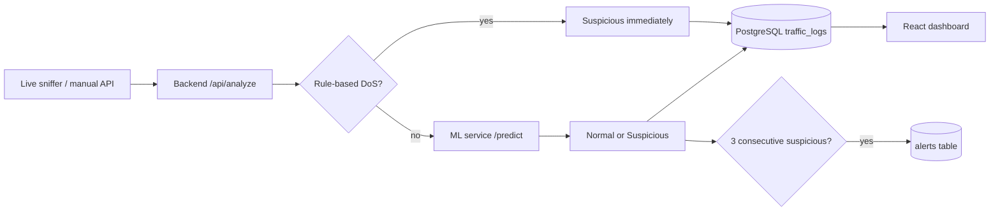

# NetGuard AI — Features v1

Network intrusion detection demo: live packet capture → Express backend → FastAPI ML service → PostgreSQL → React dashboard.

**Install, train model, and test:** see [testing-the-project.md](./testing-the-project.md).  
**Attack demos:** see [attack-readme.md](./attack-readme.md).

## Pipeline

---

## Features you have now

### 1. ML-based traffic classification

- **Random Forest** trained on **`NSL-KDD-Train.csv`** (41 features)
- Evaluated on the official **KDDTest+** benchmark (`NSL-KDD-Test.txt`) — **77.2% accuracy**, **75.7% F1** (see [model_results.md](../ml-service/docs/model_results.md))
- Output: **Normal** or **Suspicious** + **attack probability** (0–1)
- Handles protocol/service/flag encoding and probability threshold (`ML_THRESHOLD=0.4`)

**What it is:** general anomaly/intrusion scoring from flow stats.

**What it is not:** per-packet attack naming from ML alone — rules label DoS/port scan; ML returns generic `ml_anomaly`.

---

### 2. Rule-based DoS detection (deterministic)

Bypasses ML when **all three** conditions are true:

| Condition | Default threshold |
|-----------|-------------------|
| `count` | ≥ 200 packets/window |
| `serror_rate` | ≥ 0.8 |
| `dst_host_count` | ≥ 50 unique sources |

Result: **Suspicious**, `attack_type: dos`, confidence **1.0**.

---

### 3. Rule-based port scan detection

Bypasses ML when **both** conditions are true:

| Condition | Default threshold |
|-----------|-------------------|
| `count` | ≥ 50 packets/window |
| `unique_dport_count` | ≥ 20 distinct destination ports |

Result: **Suspicious**, `attack_type: port_scan`, confidence **1.0**.

---

### 4. Live packet capture

`live_sniffer.py`:

- Sniffs an interface (e.g. `wlo1`)
- Aggregates traffic **per destination IP** over a **5s window**
- Builds KDD-style features (count, `serror_rate`, bytes, etc.)
- POSTs to `/api/analyze`

---

### 5. Alert engine (backend + dashboard)

After scoring, the backend tracks **per destination IP**:

- Needs **3 consecutive suspicious windows** (`ALERT_CONSECUTIVE=3`)
- Must pass **numeric gate** (≥3 packets, or ≥5 sources, or `serror_rate` ≥ 0.3)
- **5-minute cooldown** between alerts to the same destination
- Writes to the **`alerts`** table (with feature JSON)
- **Alerts panel** on dashboard (`GET /api/alerts`)

---

### 6. IP whitelist (optional)

- Controlled by `WHITELIST_ENABLED` in `backend/.env`
- **Local default:** `false` (analyze everything)
- When enabled: skips traffic **to** whitelisted destinations (`127.*`, `192.168.*`)
- Outbound LAN → internet is still analyzed

See [readme.md](../readme.md#whitelist-local-testing-vs-production) for dev vs production profiles.

---

### 7. Dashboard (frontend)

- Stats cards (total, normal, suspicious, avg bytes)
- Traffic bar chart + pie charts
- **Alerts table** (attack type, destination, time)
- **Traffic logs** with **Attack Type** column and attack probability
- Auto-refreshes every **5 seconds**

---

## What it does not have yet

| Missing | Notes |
|---------|--------|
| Block/mitigate attacks | Detection + logging only |
| L7 attacks (SQLi, XSS) | Network flow features only |
| Email/Slack notifications | Not implemented |
| Persistent alert state | In-memory Map; resets on backend restart |

---

## Environment knobs (reference)

| Variable | Default | Purpose |
|----------|---------|---------|
| `ML_THRESHOLD` | 0.4 | Attack probability cutoff |
| `MIN_COUNT` | 3 | Min packets for alert counting |
| `ALERT_CONSECUTIVE` | 3 | Suspicious windows before alert |
| `ALERT_COOLDOWN` | 300 | Seconds between alerts per dest |
| `DOS_COUNT_THRESHOLD` | 200 | Rule-based DoS |
| `DOS_SERROR_THRESHOLD` | 0.8 | Rule-based DoS |
| `DOS_DST_HOST_COUNT` | 50 | Rule-based DoS |
| `SCAN_COUNT_THRESHOLD` | 50 | Rule-based port scan |
| `SCAN_UNIQUE_DPORT_THRESHOLD` | 20 | Rule-based port scan |
| `WHITELIST_ENABLED` | false | Skip whitelisted destinations |

---

## Report statement (optional)

The Random Forest classifier was trained on **`NSL-KDD-Train.csv`** and evaluated on the official NSL-KDD test set (**KDDTest+**, `NSL-KDD-Test.txt`). The model is a binary classifier (Normal vs Suspicious). On the official benchmark (22,544 held-out flows), it achieves **77.2% accuracy**, **96.6% precision**, **62.2% recall**, and **75.7% F1-score**. An internal 20% holdout from the training file scores ~99.9% but is supplementary only. Full results: [ml-service/docs/model_results.md](../ml-service/docs/model_results.md).
