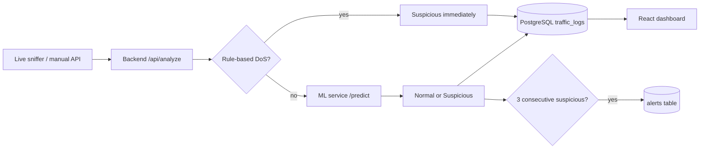

# NetGuard AI — Features v1

Network intrusion detection demo: live packet capture → Express backend → FastAPI ML service → PostgreSQL → React dashboard.

**Install, train model, and test:** see [testing-the-project.md](./testing-the-project.md).

## Pipeline

---

## Features you have now

### 1. ML-based traffic classification

- **Random Forest** trained on **NSL-KDD** (41 features)
- Output: **Normal** or **Suspicious** + **attack probability** (0–1)
- Handles protocol/service/flag encoding and probability threshold (`ML_THRESHOLD=0.4`)

**What it is:** general anomaly/intrusion scoring from flow stats.

**What it is not:** attack-type labels (no “SQL injection”, “port scan”, etc.) — only binary Normal/Suspicious.

---

### 2. Rule-based DoS detection (deterministic)

Bypasses ML when **all three** conditions are true:

| Condition | Default threshold |
|-----------|-------------------|
| `count` | ≥ 200 packets/window |
| `serror_rate` | ≥ 0.8 |
| `dst_host_count` | ≥ 50 unique sources |

Result: **Suspicious**, confidence **1.0**, `model_label: "rule:detection"`.

**What it is:** a simple **SYN-flood / DoS-style heuristic** (high volume + high SYN error rate + many sources).

**What it is not:** DDoS mitigation, rate limiting, or firewall blocking.

---

### 3. Live packet capture

`live_sniffer.py`:

- Sniffs an interface (e.g. `wlo1`)
- Aggregates traffic **per destination IP** over a **5s window**
- Builds KDD-style features (count, `serror_rate`, bytes, etc.)
- POSTs to `/api/analyze`

---

### 4. Alert engine (backend only)

After scoring, the backend tracks **per destination IP**:

- Needs **3 consecutive suspicious windows** (`ALERT_CONSECUTIVE=3`)
- Must pass **numeric gate** (≥3 packets, or ≥5 sources, or `serror_rate` ≥ 0.3)
- **5-minute cooldown** between alerts to the same destination
- Writes to the **`alerts`** table (with feature JSON)

**Note:** alerts are stored in the database but **not shown in the dashboard** yet. Check via SQL or the API response field `alerted: true`.

---

### 5. IP whitelist (optional)

- Controlled by `WHITELIST_ENABLED` in `backend/.env`
- **Local default:** `false` (analyze everything)
- When enabled: skips traffic **to** whitelisted destinations (`127.*`, `192.168.*`)
- Outbound LAN → internet is still analyzed

See [readme.md](../readme.md#whitelist-local-testing-vs-production) for dev vs production profiles.

---

### 6. Dashboard (frontend)

- Stats cards (total, normal, suspicious, avg bytes)
- Traffic bar chart
- Pie charts (status, protocol, service, flags)
- Logs table with **Attack Prob.** column
- Auto-refreshes every **5 seconds**

---

## What it does not have yet

| Missing | Notes |
|---------|--------|
| Block/mitigate attacks | Detection + logging only |
| Attack type labels | No “DDoS vs probe vs malware” |
| Alerts in UI | Stored in DB, not on dashboard |
| Email/Slack notifications | Not implemented |
| Distributed multi-node capture | Single sniffer process |
| Persistent alert state | In-memory Map; resets on backend restart |

---

## Environment knobs (reference)

| Variable | Default | Purpose |
|----------|---------|---------|
| `ML_THRESHOLD` | 0.4 | Attack probability cutoff |
| `MIN_COUNT` | 3 | Min packets for alert counting |
| `ALERT_CONSECUTIVE` | 3 | Suspicious windows before alert |
| `ALERT_COOLDOWN` | 300 | Seconds between alerts per dest |
| `DOS_COUNT_THRESHOLD` | 200 | Rule-based DoS |
| `DOS_SERROR_THRESHOLD` | 0.8 | Rule-based DoS |
| `DOS_DST_HOST_COUNT` | 50 | Rule-based DoS |
| `WHITELIST_ENABLED` | false | Skip whitelisted destinations |

---

## Report statement (optional)

The Random Forest classifier was trained using a processed subset of the NSL-KDD intrusion detection dataset. The model was configured as a binary classifier, categorizing network traffic into Normal and Suspicious classes. Performance was evaluated using accuracy, precision, recall, and F1-score metrics.
